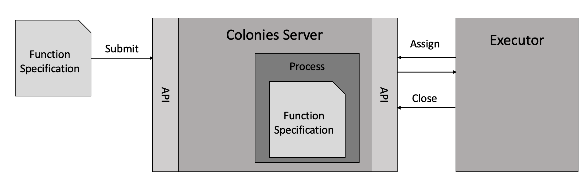

# Introduction
This repo contains a Python implementation of the [Colonies API](https://github.com/colonyos/colonies), making it possible to implement Colonies executors and applications in Python.

The library assumes *libcryptolib.so* is installed in */usr/local/lib*. However, it is also possible to set the path the cryptolib.so using an environmental variable.
```bash
export CRYPTOLIB=".../colonies/lib/cryptolib.so"
```

# Getting started
## Starting a Colonies server
You need to have access to a Colonies server. On Linux, run the commands below to start a server. See the [Colonies release page](https://github.com/colonyos/colonies/releases) for Windows and Mac binaries.

```console
git clone https://github.com/colonyos/colonies
cd colonies
source devenv
./bin/colonies dev

...
INFO[0001] Successfully started Colonies development server
INFO[0001] Press ctrl+c to exit
```

## Calling a function 
To execute a function, a function specification must be submitted to the Colonies server. The function is then executed by a so-called executor that may reside anywhere on the Internet, for example in a Kubernetes Pod, an IoT device, a virtual machine on an edge server, or a smart phone. The Colonies server acts a mediator, matching function specification with suitable executors.



After a function specification has been submitted, a process is created on the Colonies server. A process in this case is not a operating system process or anything like that, but rather a database entry containing instructions how to execute the function. It also contains contextual information such as execution status, priority, submission time, and environmental variables, input and output values etc. An executor then uses the Colonies HTTP API to manipulate process information, e.g. closing the process after executing the specified function.

Below is an example of function specification.
```json
{
    "conditions": {
        "executortype": "echo_executor"
    },
    "func": "echo",
    "args": [
        "helloworld"
    ]
}
```

The function specification also contains requirements (conditions) that needs to be fulfilled for the function to be executed. In this case, only executors of the "echo-executor" type may execute the function.

A function specification can be submitted using the Colonies CLI.
```console
colonies function submit --spec echo_func_spec.json

INFO[0000] Process submitted                             ProcessID=ea398af346db85f45b118bb77ecda9ae25f4700dcafcccb4ba3e4d40eba5205a
```

We can also look up the process using the CLI,
```console
colonies process get -p ea398af346db85f45b118bb77ecda9ae25f4700dcafcccb4ba3e4d40eba5205a 

Process:
+--------------------+------------------------------------------------------------------+
| ID                 | ea398af346db85f45b118bb77ecda9ae25f4700dcafcccb4ba3e4d40eba5205a |
| IsAssigned         | False                                                            |
| AssignedExecutorID | None                                                             |
| State              | Waiting                                                          |
| Priority           | 0                                                                |
| SubmissionTime     | 2023-03-12 21:06:55                                              |
| StartTime          | 0001-01-01 01:12:12                                              |
| EndTime            | 0001-01-01 01:12:12                                              |
| WaitDeadline       | 0001-01-01 01:12:12                                              |
| ExecDeadline       | 0001-01-01 01:12:12                                              |
| WaitingTime        | 29.587933822s                                                    |
| ProcessingTime     | 0s                                                               |
| Retries            | 0                                                                |
| Errors             |                                                                  |
| Output             |                                                                  |
+--------------------+------------------------------------------------------------------+

FunctionSpec:
+-------------+-------------+
| Func        | echo        |
| Args        | helloworld  |
| MaxWaitTime | -1          |
| MaxExecTime | -1          |
| MaxRetries  | 0           |
| Priority    | 0           |
+-------------+-------------+

Conditions:
+--------------+------------------------------------------------------------------+
| ColonyID     | 4787a5071856a4acf702b2ffcea422e3237a679c681314113d86139461290cf4 |
| ExecutorIDs  | None                                                             |
| ExecutorType | echo_executor                                                    |
| Dependencies |                                                                  |
+--------------+------------------------------------------------------------------+

Attributes:
No attributes found
```

The command below shows all waiting processes. The process will just be enqueued since we don't yet have an executor of the type "echo_executor". 
```console
colonies process psw
INFO[0000] Starting a Colonies client                    Insecure=true ServerHost=localhost ServerPort=50080
+------------------------------------------------------------------+------+------------+---------------------+---------------+
|                                ID                                | FUNC |    ARGS    |   SUBMISSION TIME   | EXECUTOR TYPE |
+------------------------------------------------------------------+------+------------+---------------------+---------------+
| 4787a5071856a4acf702b2ffcea422e3237a679c681314113d86139461290cf4 | echo | helloworld | 2023-03-12 21:09:09 | echo_executor |
+------------------------------------------------------------------+------+------------+---------------------+---------------+
```

We can of course also submit a function specification directly from Python.
```python
colonies = Colonies("localhost", 50080)
func_spec = colonies.create_func_spec(func="echo", 
                                      args=["helloworld"], 
                                      colonyid=colonyid, 
                                      executortype="echo_executor",
                                      priority=200,
                                      maxexectime=100,
                                      maxretries=3,
                                      maxwaittime=100)

process = colonies.submit(func_spec, executor_prvkey)
```

See [echo.py](https://github.com/colonyos/pycolonies/blob/main/examples/echo.py) for a full example. Type the command below to submit an another echo function spec. 

```console
python3 examples/echo.py
```

## Implementing an executor in Python
An executor is responsible for executing one or several functions. It connects to the Colonies server to get process assignments. 

The executor needs to be member of a colony in order to connect to the Colonies server and execute processes. A colony is like a project/namespace/tenant where one or several executors are members. Only the colony owner may add (register) executors to a colony and executors can only interact with other executors member of the same colony. More specifically, all messages sent to the Colonies server must be signed by the executor's private key. 

Since we have access to the colony private key, we can implement an self-registering executor. 
```python
colonies = Colonies("localhost", 50080)
crypto = Crypto()
colonyid = "4787a5071856a4acf702b2ffcea422e3237a679c681314113d86139461290cf4"
colony_prvkey="ba949fa134981372d6da62b6a56f336ab4d843b22c02a4257dcf7d0d73097514"
executor_prvkey = crypto.prvkey()
executorid = crypto.id(self.executor_prvkey)

executor = {
    "executorname": "echo_executor",
    "executorid": executorid,
    "colonyid": colonyid,
    "executortype": "echo_executor"
}

colonies.add_executor(executor, self.colony_prvkey)
colonies.approve_executor(self.executorid, self.colony_prvkey)
```

We are also going register the *echo* function, telling the Colonies server that this executor is capable of executing a function called *echo*. One important reason to register the function is to prevent executing of arbitrary functions. This is going to be extra important when using code injection in the next section.

```python
colonies.add_function(executorid, 
                      colonyid, 
                      "echo",  
                      ["arg"], 
                      "Python function that returns it input as output", 
                      self.executor_prvkey)
```

The next step is to connect the Colonies server to get process assignments. Note that the Colonies server never establish connections to the executors, but rather executors connects to the Colonies server. In this way, executors may run behind firewalls without problems. The *assign* function below will block for 10 seconds if there are no suitable process assignments.

```python
process = colonies.assign(self.colonyid, 10, self.executor_prvkey)
if process["spec"]["funcname"] == "echo":
    assigned_args = process["spec"]["args"]
    self.colonies.close(process["processid"], [arg], self.executor_prvkey)
```

The *close* method sets the output (same the args in this case) and the process state to "successful". Only the executor assigned to a process may alter process information stored on the Colonies server. By setting the *maxexectime* attribute on the function spec, it is possible to specify how long time an executor may run a process before is released back the waiting queue at the Colonies server. This is a very useful feature to implement robust processing pipelines.

See [echo.py](https://github.com/colonyos/pycolonies/blob/main/examples/echo_executor.py) for a full example. Type the command below to start the *echo executor*. 

```console
python3 examples/echo_executor.py
```

# Code-injection
Python has a built-in *eval()* function that allows execution of any piece of Python code encoded as strings. We are going to use the *eval()* function to implement an executor that can execute arbitrary Python functions.
   
Python also has support introspection, which allows Python code to examine itsef. We are going to use that to get the source code of function definitions, e.g. the echo function.
```python
def echo(arg)
    return arg

code = inspect.getsource(echo)
```

We are now going to base64 encode the obtained code and add it to the function specification, allowing an executor to inject the code and then execute it.
```python
code_bytes = code.encode("ascii")
code_base64_bytes = base64.b64encode(code_bytes)
code_base64 = code_base64_bytes.decode("ascii")

func_spec = {
    "funcname": "echo",
    "args": ["helloworld"],
    "priority": 0,
    "maxwaittime": -1,
    "maxexectime": 200,
    "maxretries": 3,
    "conditions": {
        "colonyid": colonyid,
        "executortype": executortype
    },
    "env": {
        "code": code_base64,
    },
}
```

The executor can now obtain the code, inject it, and then execute the specified function.
```python
assigned_process = colonies.assign(colonyid, 10, executor_prvkey)

code_base64 = assigned_process["spec"]["env"]["code"]
code_bytes2 = base64.b64decode(code_base64)
code = code_bytes2.decode("ascii")

exec(code)
res = eval(funcname)(*tuple(args))
colonies.close(assigned_process["processid"], [res], executor_prvkey)
```

We can now can create a distributed Python application where parts of the code runs on a remote executor.

```python
def sum_nums(n1, n2, ctx={}):
    return n1 + n2

func_spec = colonies.create_func_spec(func=sum_nums, 
                                      args=[1, 2], 
                                      colonyid=colonyid, 
                                      executortype="python_executor",
                                      priority=200,
                                      maxexectime=100,
                                      maxretries=3,
                                      maxwaittime=100)

submitted_process = colonies.submit(func_spec, executor_prvkey)
completed_process = colonies.wait(submitted_process, 100, executor_prvkey)
```

See [func_spec_example1.py](https://github.com/colonyos/pycolonies/blob/main/examples/func_spec_example1.py) and [python_executor.py](https://github.com/colonyos/pycolonies/blob/main/examples/python_executor.py) for a full example. Type the commands below to try it out. 

```console
python3 examples/func_spec_example1.py

Process df7cf3a54af88627ec45b525128ada2bd30c352d58f49f5a59c55fa04c781a8d submitted
3
```
And in another terminal:
```console
python3 examples/python_executor.py

Executor de28c7ca3526a9d6a94e78ead8f44966670389aeeeda86e6f84b5d98b722db30 registered

Process df7cf3a54af88627ec45b525128ada2bd30c352d58f49f5a59c55fa04c781a8d is assigned to Executor
Executing: sum_nums
```

It is also possible to use the Colonies CLI to list registered functions:
```console
colonies function ls

Function:
+-------------+-----------------+
| FuncName    | sum_nums(n1,n2) |
| Calls       | 8               |
| Served by   | 1 executors     |
| MinWaitTime | 0.009829 s      |
| MaxWaitTime | 0.060579 s      |
| AvgWaitTime | 0.053648 s      |
| MinExecTime | 0.007275 s      |
| MaxExecTime | 0.011074 s      |
| AvgExecTime | 0.008911 s      |
+-------------+-----------------+
```

# Workflows and DAGs


