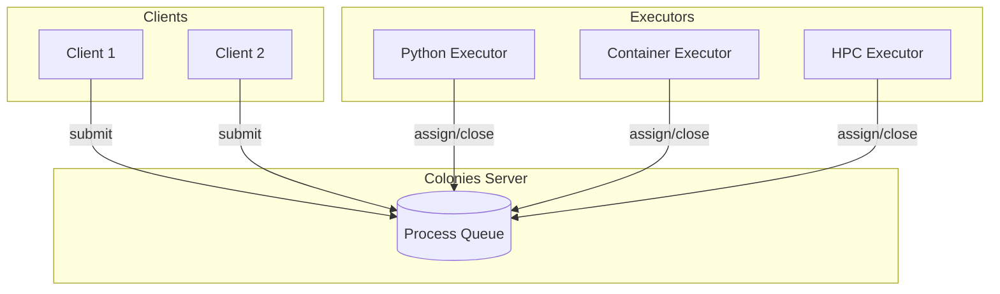
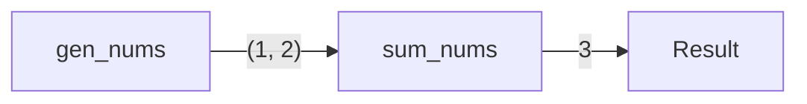
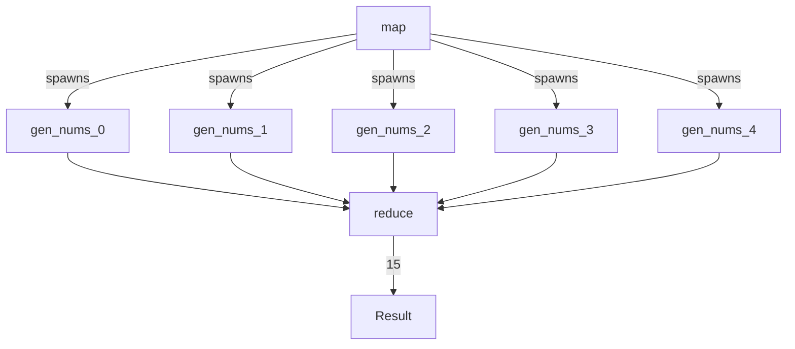

[](https://github.com/colonyos/pycolonies/actions/workflows/python.yml)

# PyColonies

Python SDK for [ColonyOS](https://github.com/colonyos/colonies) - build distributed applications with executors that can run anywhere.

## Installation

```bash
pip3 install pycolonies
```

## Quick Start

### Starting a Colonies Server

```bash
wget https://raw.githubusercontent.com/colonyos/colonies/main/docker-compose.env
source docker-compose.env
wget https://raw.githubusercontent.com/colonyos/colonies/main/docker-compose.yml
docker-compose up -d
```

### Submitting a Function

```python
from pycolonies import Colonies, func_spec

client = Colonies("localhost", 50080, tls=False)
prvkey = "ddf7f7791208083b6a9ed975a72684f6406a269cfa36f1b1c32045c0a71fff05"

spec = func_spec(
    func="echo",
    args=["hello world"],
    colonyname="dev",
    executortype="container-executor",
    maxexectime=60,
    maxwaittime=60
)

process = client.submit_func_spec(spec, prvkey)
print(f"Process submitted: {process.processid}")
```

### Implementing an Executor

```python
from pycolonies import Colonies
from crypto import Crypto

client = Colonies("localhost", 50080, tls=False)
colony_prvkey = "ba949fa134981372d6da62b6a56f336ab4d843b22c02a4257dcf7d0d73097514"

# Generate executor keys
crypto = Crypto()
executor_prvkey = crypto.prvkey()
executorid = crypto.id(executor_prvkey)

# Register executor
executor = {
    "executorname": "my-executor",
    "executorid": executorid,
    "colonyname": "dev",
    "executortype": "python-executor"
}
client.add_executor(executor, colony_prvkey)
client.approve_executor(executorid, colony_prvkey)

# Process loop
while True:
    process = client.assign("dev", 10, executor_prvkey)
    if process:
        result = process.spec.args[0]  # Echo the first arg
        client.close(process.processid, [result], executor_prvkey)
```

## CLI Examples

List executors:
```console
$ colonies executor ls

╭────────────┬────────────────────┬──────────┬─────────────────────╮
│ NAME       │ TYPE               │ LOCATION │ LAST HEARD FROM     │
├────────────┼────────────────────┼──────────┼─────────────────────┤
│ dev-docker │ container-executor │ Local    │ 2025-12-27 22:13:44 │
╰────────────┴────────────────────┴──────────┴─────────────────────╯
```

List colonies:
```console
$ colonies colony ls

╭──────┬──────────────────────────────────────────────────────────────────╮
│ NAME │ COLONYID                                                         │
├──────┼──────────────────────────────────────────────────────────────────┤
│ dev  │ 4787a5071856a4acf702b2ffcea422e3237a679c681314113d86139461290cf4 │
╰──────┴──────────────────────────────────────────────────────────────────╯
```

## Architecture



## Features

- **Processes**: Submit function specifications, assign to executors, track state
- **Workflows**: Create DAGs with dependencies between functions
- **Channels**: Real-time bidirectional communication during execution
- **Blueprints**: Declarative resource management with reconciliation
- **File Storage**: Distributed file sync with S3-compatible backends

## Documentation

- [API Reference](docs/api-spec.md) - Complete API specification
- [Channels](docs/channels.md) - Real-time streaming between client and executor
- [Blueprints](docs/blueprints.md) - Declarative resource management
- [Workflows](docs/workflows.md) - Computational DAGs and MapReduce patterns

## Workflows

Create computational DAGs where functions execute across different executors:

```python
from pycolonies import Colonies, func_spec, Workflow

def gen_nums(ctx={}):
    return 1, 2

def sum_nums(n1, n2, ctx={}):
    return n1 + n2

wf = Workflow(colonyname="dev")

f1 = func_spec(func=gen_nums, args=[], colonyname="dev",
               executortype="python-executor", maxexectime=60, maxwaittime=60)
wf.functionspecs.append(f1)

f2 = func_spec(func=sum_nums, args=[], colonyname="dev",
               executortype="python-executor", maxexectime=60, maxwaittime=60)
f2.conditions.dependencies.append("gen_nums")
wf.functionspecs.append(f2)

processgraph = client.submit_workflow(wf, prvkey)
```



### Dynamic Workflows (MapReduce)

Functions can dynamically add child processes during execution:



See [workflows tutorial](docs/workflows.md) for complete examples.

## Cleanup

```bash
docker-compose down --volumes
```

## Examples

See the [examples](examples/) directory for complete working examples:

- `echo_executor.py` - Simple echo executor
- `python_executor.py` - Code-injection executor
- `submit_echo.py` - Submit echo function
- `submit_python.py` - Submit Python function
- `workflow_example.py` - Workflow submission

## Testing

```bash
make setup  # Install dependencies and setup test environment
make test   # Run all tests
```

## License

MIT
