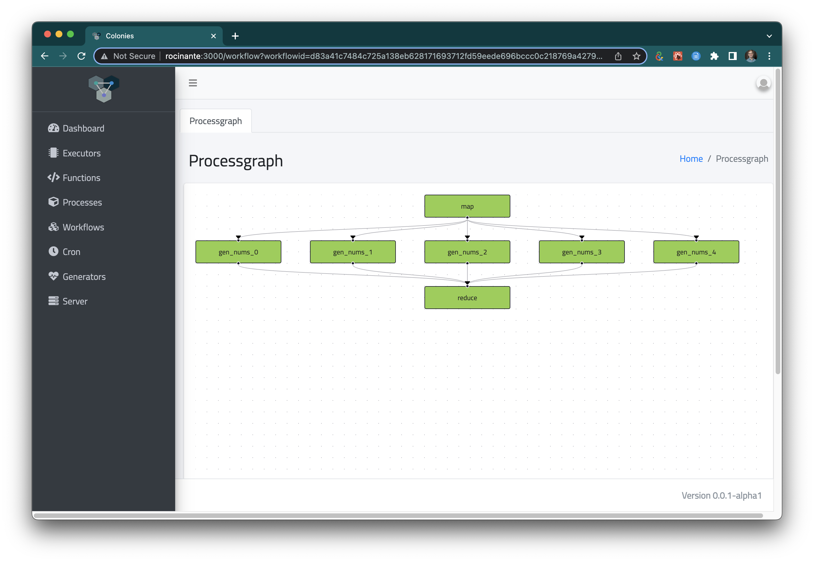

[](https://github.com/colonyos/pycolonies/actions/workflows/python.yml)

# Introduction
This repo contains a Python [Colonies](https://github.com/colonyos/colonies), making it possible to implement Colonies Executors in Python. 

# Installation 
Note that the SDK has only be tested on Linux and MacOS. 

```bash
pip3 install pycolonies
```

## Starting a Colonies server
You need to have access to a Colonies server. 

```bash
wget https://raw.githubusercontent.com/colonyos/colonies/main/docker-compose.env;
source docker-compose.env;
wget https://raw.githubusercontent.com/colonyos/colonies/main/docker-compose.yml;
docker-compose up
```

Press control-c to exit.

To remove all data, type:

```bash
docker-compose down --volumes
```

See the [Colonies release page](https://github.com/colonyos/colonies/releases) for Windows and Mac binaries.

## Calling a function 
To execute a function, a function specification must be submitted to the Colonies server. Colonies will then wrap the function specification in a process and assign the process to an Executor.

Below is an example of function specification.
```json
{
    "conditions": {
        "executortype": "echo_executor"
    },
    "func": "echo",
    "args": [
        "helloworld"
    ],
    "priority": 0,
    "maxexectime": 10,
    "maxretries": 3,
    "maxwaittime": 100,

}
```

A function specification can be submitted using the Colonies CLI.
```console
colonies function submit --spec echo_func_spec.json

INFO[0000] Process submitted                             ProcessID=ea398af346db85f45b118bb77ecda9ae25f4700dcafcccb4ba3e4d40eba5205a
```

Or using the Python SDK.
```python
spec = func_spec(
            func=sum_nums, 
            args=["helloworld"], 
            colonyname=colonyname, 
            executortype="echo_executor",
            priority=0,
            maxexectime=10,
            maxretries=3,
            maxwaittime=100
        )

process = colonies.submit_func_spec(spec, executor_prvkey)
```
See [echo.py](https://github.com/colonyos/pycolonies/blob/main/examples/submit_echo.py) for a full example. 

Now it possible to look up the process using the Colonies CLI.
```console
colonies process get -p fd20992e624aa27dac064ce6853556fc0f1fd68369ca219b0ff483be5c441e62

╭───────────────────────────────────────────────────────────────────────────────────────╮
│ Process                                                                               │
├────────────────────┬──────────────────────────────────────────────────────────────────┤
│ Id                 │ fd20992e624aa27dac064ce6853556fc0f1fd68369ca219b0ff483be5c441e62 │
│ IsAssigned         │ False                                                            │
│ InitiatorID        │ 3fc05cf3df4b494e95d6a3d297a34f19938f7daa7422ab0d4f794454133341ac │
│ Initiator          │ myuser                                                           │
│ AssignedExecutorID │ None                                                             │
│ AssignedExecutorID │ Waiting                                                          │
│ PriorityTime       │ 1704037946987524185                                              │
│ SubmissionTime     │ 2024-07-18 17:52:26                                              │
│ StartTime          │ 2024-07-18 17:52:26                                              │
│ EndTime            │ 2024-07-18 17:52:26                                              │
│ WaitDeadline       │ 2024-07-18 17:54:06                                              │
│ ExecDeadline       │ 0001-01-01 00:53:28                                              │
│ WaitingTime        │ 34.060359471s                                                    │
│ ProcessingTime     │ 0s                                                               │
│ Retries            │ 0                                                                │
│ Input              │                                                                  │
│ Output             │                                                                  │
│ Errors             │                                                                  │
╰────────────────────┴──────────────────────────────────────────────────────────────────╯
╭───────────────────────────╮
│ Function Specification    │
├─────────────┬─────────────┤
│ Func        │ echo        │
│ Args        │ helloworld  │
│ KwArgs      │ None        │
│ MaxWaitTime │ 100         │
│ MaxExecTime │ 100         │
│ MaxRetries  │ 3           │
│ Label       │             │
╰─────────────┴─────────────╯
╭──────────────────────────────────╮
│ Conditions                       │
├──────────────────┬───────────────┤
│ Colony           │ dev           │
│ ExecutorNames    │ None          │
│ ExecutorType     │ echo-executor │
│ Dependencies     │               │
│ Nodes            │ 0             │
│ CPU              │ 0m            │
│ Memory           │ 0Mi           │
│ Processes        │ 0             │
│ ProcessesPerNode │ 0             │
│ Storage          │ 0Mi           │
│ Walltime         │ 0             │
│ GPUName          │               │
│ GPUs             │ 0             │
│ GPUPerNode       │ 0             │
│ GPUMemory        │ 0Mi           │
╰──────────────────┴───────────────╯

No attributes found
```

The command below shows all waiting processes. Note that the process is just enqueued since we don't yet have an Executor of the type *echo_executor*. 
```console
colonies process psw

╭──────────┬────────────┬────────┬─────────────────────┬───────────────┬───────────────┬───────────┬───────╮
│ FUNCNAME │ ARGS       │ KWARGS │ SUBMSSION TIME      │ EXECUTOR NAME │ EXECUTOR TYPE │ INITIATOR │ LABEL │
├──────────┼────────────┼────────┼─────────────────────┼───────────────┼───────────────┼───────────┼───────┤
│ echo     │ helloworld │        │ 2024-07-18 17:52:26 │               │ echo-executor │ myuser    │       │
╰──────────┴────────────┴────────┴─────────────────────┴───────────────┴───────────────┴───────────┴───────╯
```

## Implementing an Executor in Python
Executors are responsible for executing processes. They connect to the Colonies server and get process assignments. To be able to submit function specifications or get process assignments, an Executor must be a member of a Colony. Only the Colony owner has the authority to add an Executor to a Colony. In order to interact with the Colonies server and other Executors, Executors must authenticate and prove their membership. This security mechanism is implemented through the utilization of public key encryption.

Since we have access to the Colony private key (see devenv file), we can implement a self-registering Executor. 
```python
colonies = Colonies("localhost", 50080)
crypto = Crypto()
colonyname = "4787a5071856a4acf702b2ffcea422e3237a679c681314113d86139461290cf4"
colony_prvkey="ba949fa134981372d6da62b6a56f336ab4d843b22c02a4257dcf7d0d73097514"
executor_prvkey = crypto.prvkey()
executorid = crypto.id(executor_prvkey)

executor = {
    "executorname": "echo_executor",
    "executorid": executorid,
    "colonyname": colonyname,
    "executortype": "echo_executor"
}

colonies.add_executor(executor, colony_prvkey)
colonies.approve_executor(executorid, colony_prvkey)
```

*Optinally:* We also need to register the `echo` function, telling the Colonies server that this executor is capable of executing a function called `echo`. 

```python
colonies.add_function(executorid, 
                      colonyname, 
                      "echo",  
                      ["arg"], 
                      "Python function that returns its input as output", 
                      executor_prvkey)
```

The next step is to connect the Colonies server and get process assignments. Note that the Colonies server never establish connections to the Executors, but rather it the responsibility of the Executors to connects to the Colonies server. In this way, Executors may run behind firewalls without problems. The `assign` function below will block for 10 seconds if there are no suitable process to assign.

```python
process = colonies.assign(colonyname, 10, executor_prvkey)
if process.spec.funcname == "echo":
    assigned_args = process.spec.args
    colonies.close(process.processid, [arg], executor_prvkey)
```

The *close* method sets the output (same the args in this case) and the process state to *successful*. Only the Executor assigned to a process may alter process information stored on the Colonies server. By setting the *maxexectime* attribute on the function spec, it is possible to specify how long an executor may run a process before it is released back the waiting queue at the Colonies server. This is a very useful feature to implement robust processing pipelines.

See [echo_executor.py](https://github.com/colonyos/pycolonies/blob/main/examples/echo_executor.py) for a full example. Type the command below to start the *echo Executor*. 

```console
python3 examples/echo_executor.py
```

# Code-injection
Python has a built-in `eval()` function that allows execution of any piece of Python code encoded as strings. We are going to use the `eval()` function to implement an executor that can execute arbitrary Python functions.
   
Python also has support for introspection, which allows Python code to examine itself. We are going to use that to get the source code of function definitions, e.g. the `echo` function.
```python
def echo(arg)
    return arg

code = inspect.getsource(echo)
```

We are now going to base64 encode the obtained code and add it to the function specification, allowing an executor to inject the code and then execute it.
```python
code_bytes = code.encode("ascii")
code_base64_bytes = base64.b64encode(code_bytes)
code_base64 = code_base64_bytes.decode("ascii")

func_spec = {
    "funcname": "echo",
    "args": ["helloworld"],
    "priority": 0,
    "maxwaittime": -1,
    "maxexectime": 200,
    "maxretries": 3,
    "conditions": {
        "colonyname": colonyname,
        "executortype": executortype
    },
    "env": {
        "code": code_base64,
    },
}
```

The executor can now obtain the code, inject it, and then execute the specified function.
```python
assigned_process = colonies.assign(colonyname, 10, executor_prvkey)

code_base64 = assigned_process.spec.env["code"]
code_bytes2 = base64.b64decode(code_base64)
code = code_bytes2.decode("ascii")

exec(code)
res = eval(funcname)(*tuple(args))
colonies.close(assigned_process.processid, [res], executor_prvkey)
```

We can now create a distributed Python application where parts of the code runs on a remote executor.

```python
def sum_nums(n1, n2, ctx={}):
    return n1 + n2

spec = func_spec(
            func=sum_nums, 
            args=[1, 2], 
            colonyname=colonyname, 
            executortype="python_executor",
            priority=200,
            maxexectime=100,
            maxretries=3,
            maxwaittime=100
        )

submitted_process = colonies.submit_func_spec(spec, executor_prvkey)
completed_process = colonies.wait(submitted_process, 100, executor_prvkey)
```

The `wait()` function blocks until the submitted process is completed, either successful or failed.

See [func_spec_example1.py](https://github.com/colonyos/pycolonies/blob/main/examples/submit_python.py) and [python_executor.py](https://github.com/colonyos/pycolonies/blob/main/examples/python_executor.py) for a full example. Type the commands below to try it out. 

```console
python3 examples/submit_python.py

Process df7cf3a54af88627ec45b525128ada2bd30c352d58f49f5a59c55fa04c781a8d submitted
3
```
And in another terminal:
```console
python3 examples/python_executor.py

Executor de28c7ca3526a9d6a94e78ead8f44966670389aeeeda86e6f84b5d98b722db30 registered

Process df7cf3a54af88627ec45b525128ada2bd30c352d58f49f5a59c55fa04c781a8d is assigned to Executor
Executing: sum_nums
```

It is also possible to use the Colonies CLI to list registered functions:
```console
colonies function ls

╭───────────────────────────────────╮
│ Function: execute                 │
├──────────────┬────────────────────┤
│ ExecutorType │ container-executor │
│ FunctionName │ execute            │
│ Call counter │ 0                  │
│ MinWaitTime  │ 0.000000 s         │
│ MaxWaitTime  │ 0.000000 s         │
│ AvgWaitTime  │ 0.000000 s         │
│ MinExecTime  │ 0.000000 s         │
│ MaxExecTime  │ 0.000000 s         │
│ AvgExecTime  │ 0.000000 s         │
╰──────────────┴────────────────────╯
╭────────────────────────────────╮
│ Function: sum_nums             │
├──────────────┬─────────────────┤
│ ExecutorType │ python-executor │
│ FunctionName │ sum_nums        │
│ Call counter │ 1               │
│ MinWaitTime  │ 12.788976 s     │
│ MaxWaitTime  │ 12.788976 s     │
│ AvgWaitTime  │ 12.788976 s     │
│ MinExecTime  │ 0.022253 s      │
│ MaxExecTime  │ 0.022253 s      │
│ AvgExecTime  │ 0.022253 s      │
╰──────────────┴─────────────────╯
```

# Workflows
Colonies supports creation of computational DAGs (Directed Acyclic Graphs). This makes it possible to create dependencies between several functions, i.e. control the order which functions are called and pass values between function calls, even if they run on different Executors. Since Executors may reside *anywhere* on the Internet, we can create workflows that are executed across platforms and infrastructures, **creating compute continuums**. 

The example below calculates `sum_nums(gen_nums())`. The `gen_nums()` function simply return a tuple containing 1 and 2. The `sum_nums()` function takes two arguments and calculates the sum of them.

```python
def gen_nums(ctx={}):
    return 1, 2 

def sum_nums(n1, n2, ctx={}):
    return n1 + n2 

wf = Workflow(colonyname=colonyname)
f = func_spec(func=gen_nums,
              args=[], 
              colonyname=colonyname, 
              executortype="python-executor",
              priority=200,
              maxexectime=100,
              maxretries=3,
              maxwaittime=100)

wf.functionspecs.append(f)

f = func_spec(func=sum_nums, 
              args=[], 
              colonyname=colonyname, 
              executortype="python-executor",
              priority=200,
              maxexectime=100,
              maxretries=3,
              maxwaittime=100)

f.conditions.dependencies.append("gen_nums")

wf.functionspecs.append(f)

processgraph = colonies.submit_workflow(wf, prvkey)
```

## Dynamic processgraphs
 It also possible to dynamically modify a processgraph while it is still active, e.g. a function may submit more function specifications to a workflow while executing. This makes it possible to implement patterns like [MapReduce](https://en.wikipedia.org/wiki/MapReduce).

The `map()` function below dynamically adds 5 `gen_nums()` functions to the processgraph.

```python
def map(ctx={}):
    code = """def gen_nums(ctx={}):
                return 1, 2""" 
    processgraphid = ctx["process"].processgraphid
    map_processid = ctx["process"].processid
    executor_prvkey = ctx["executor_prvkey"]
  
    processgraph = colonies.get_processgraph(processgraphid, executor_prvkey)

    reduce_process = colonies.find_process("reduce", processgraph.processids, executor_prvkey)
    reduce_processid = reduce_process.processid

    insert = True
    for i in range(1):
        f = func_spec(func="gen_nums", 
                      args=[], 
                      colonyname=ctx["colonyname"], 
                      executortype="python-executor",
                      priority=200,
                      maxexectime=100,
                      maxretries=3,
                      maxwaittime=100,
                      code=code)


        colonies.add_child(processgraphid, map_processid, reduce_processid, f, "gen_nums_" + str(i), insert, executor_prvkey)

        insert = False
```

The `reduce()` function takes arbitrary integer arguments and returns the sum of them. 

```python
def reduce(*nums, ctx={}):
    total = 0
    for n in nums:
        total += n
    return total 
```

We can now create a workflow to calculate: `reduce(gen_nums(), gen_nums(), gen_nums(), gen_nums(), gen_nums())`. The result should be (1+2)*5=15.

```python
wf = Workflow(colonyname=colonyname)

f = func_spec(func=map, 
              args=[], 
              colonyname=colonyname, 
              executortype="python-executor",
              priority=200,
              maxexectime=100,
              maxretries=3,
              maxwaittime=100)

wf.functionspecs.append(f)

f = func_spec(func=reduce, 
              args=[], 
              colonyname=colonyname, 
              executortype="python-executor",
              priority=200,
              maxexectime=100,
              maxretries=3,
              maxwaittime=100)

f.conditions.dependencies.append("map")
wf.functionspecs.append(f)

processgraph = colonies.submit_workflow(wf, prvkey)
```



# Monadic workflows
The workflow code can be significantly simplified by expressing it as a monad. A good introduction to monads can be found [here](https://brian-candler.medium.com/function-composition-with-bind-4f6e3fdc0e7). The example below is not a complete monad, but illustrated how the Colonies *plumbing* can be removed and create elegant functional expressions. The `>>` operator is usually call the `bind` functions and makes it possible to chain function calls.   

```python
def gen_data(ctx={}):
    return 1, 2 

def process_data(*nums, ctx={}):
    total = 0
    for n in nums:
        total += n
    return total 

gen_data = Function(gen_data, colonyname, executortype="python_executor")
process_data = Function(process_data, colonyname, executortype="python_executor")
echo = Function("echo", colonyname, executortype="echo_executor")

m = ColoniesMonad("localhost", 50080, colonyname, executor_prvkey)
result = (m >> gen_data >> process_data >> echo).unwrap()
print(result)  # prints 3 
```

See [colonies_monad.py](https://github.com/colonyos/pycolonies/blob/main/examples/colonies_monad.py) and [monad_example2.py](https://github.com/colonyos/pycolonies/blob/main/examples/monad_example2.py) for a full example.
