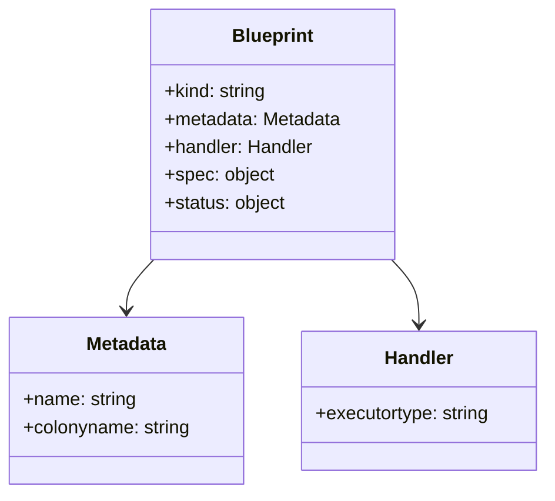
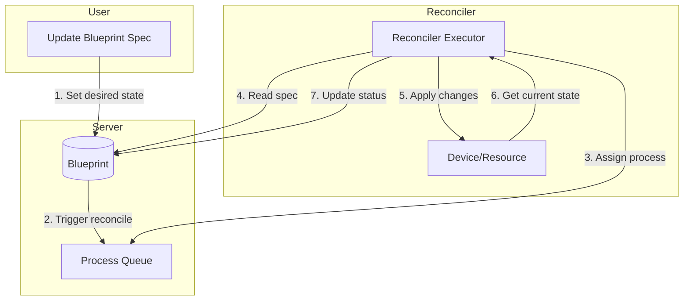
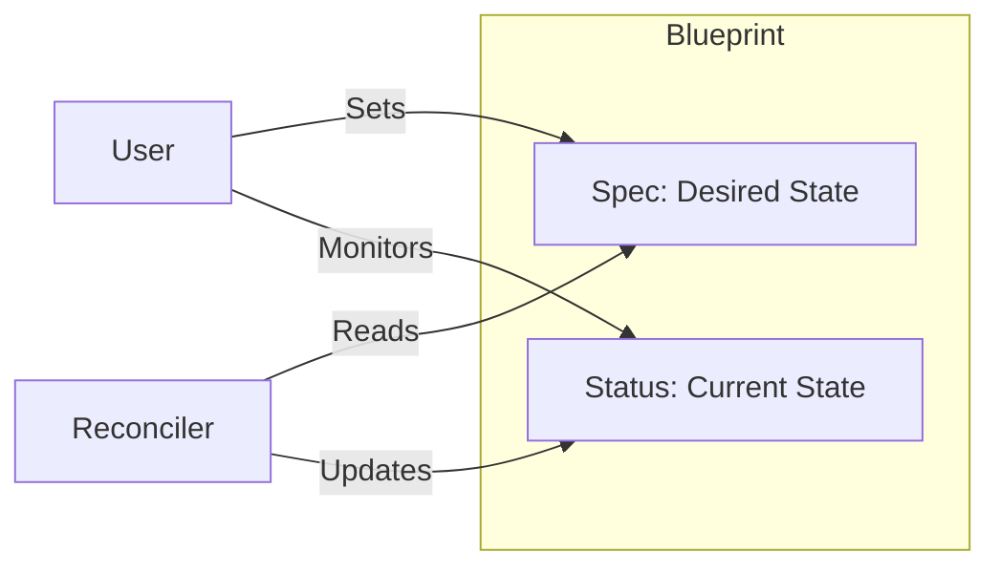
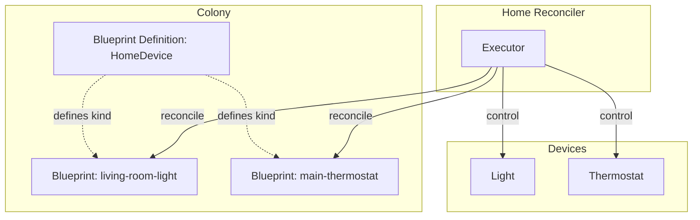
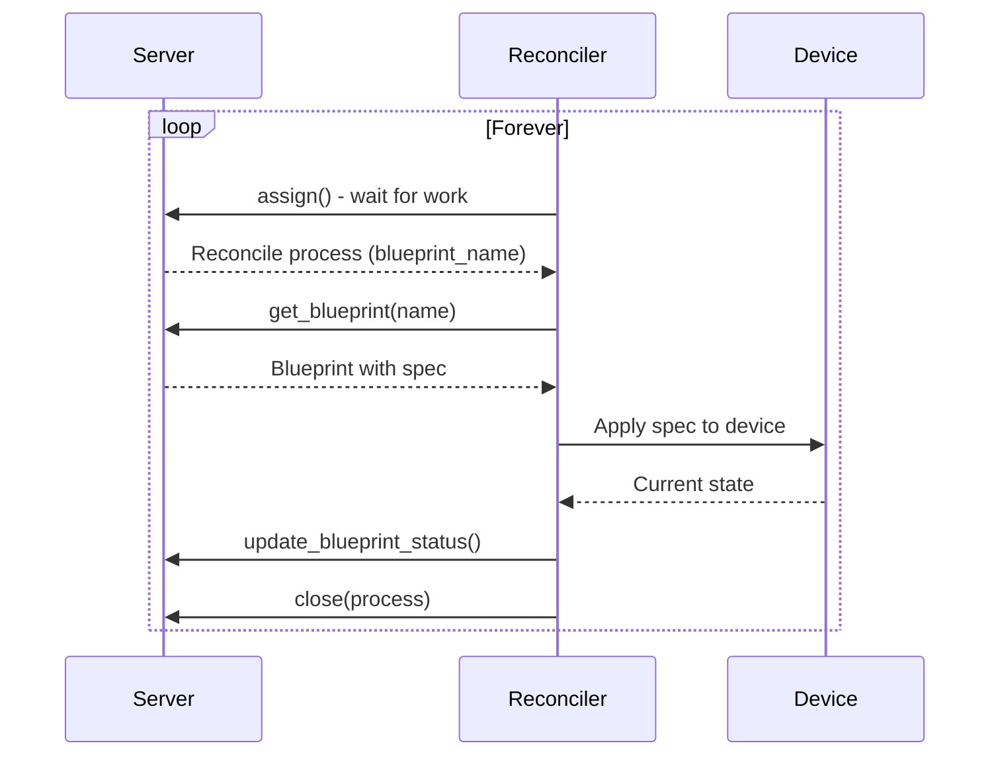

# Blueprints Tutorial

Blueprints provide a declarative way to manage resources in ColonyOS. They follow a reconciliation pattern where you define a desired state (spec) and a reconciler executor ensures the actual state matches.

## Overview

A blueprint consists of:
- **Kind**: The type of resource (e.g., "Container", "HomeDevice")
- **Metadata**: Name and colony information
- **Handler**: Which executor type handles reconciliation
- **Spec**: Desired state
- **Status**: Current state (updated by reconciler)



## Reconciliation Loop

The reconciler continuously ensures the actual state matches the desired state:



## Blueprint Definitions

Before creating blueprints, you need a blueprint definition that describes the kind. Definitions require colony owner privileges.

```python
from pycolonies import Colonies

client = Colonies("localhost", 50080, tls=False)
colony_prvkey = "your_colony_owner_private_key"

# Create a blueprint definition
definition = {
    "kind": "HomeDevice",
    "metadata": {
        "name": "home-device-def",
        "colonyname": "my_colony"
    },
    "spec": {
        "names": {
            "kind": "HomeDevice"
        }
    }
}

client.add_blueprint_definition(definition, colony_prvkey)

# List all definitions
definitions = client.get_blueprint_definitions("my_colony", colony_prvkey)

# Get a specific definition
definition = client.get_blueprint_definition("my_colony", "home-device-def", colony_prvkey)

# Remove a definition
client.remove_blueprint_definition("my_colony", "home-device-def", colony_prvkey)
```

## Creating Blueprints

Once a definition exists, executors can create blueprint instances:

```python
executor_prvkey = "your_executor_private_key"

# Create a blueprint instance
blueprint = {
    "kind": "HomeDevice",
    "metadata": {
        "name": "living-room-light",
        "colonyname": "my_colony"
    },
    "handler": {
        "executortype": "home-reconciler"
    },
    "spec": {
        "deviceType": "light",
        "power": True,
        "brightness": 80
    }
}

client.add_blueprint(blueprint, executor_prvkey)
```

## Reading and Listing Blueprints

```python
# Get a specific blueprint
bp = client.get_blueprint("my_colony", "living-room-light", executor_prvkey)
print(f"Power: {bp['spec']['power']}, Brightness: {bp['spec']['brightness']}")

# List all blueprints in a colony
blueprints = client.get_blueprints("my_colony", executor_prvkey)
for bp in blueprints or []:
    print(f"{bp['metadata']['name']}: {bp['kind']}")

# Filter by kind
home_devices = client.get_blueprints("my_colony", executor_prvkey, kind="HomeDevice")
```

## Updating Blueprints

Update the desired state (spec):

```python
# Get current blueprint
blueprint = client.get_blueprint("my_colony", "living-room-light", executor_prvkey)

# Modify the spec
blueprint['spec']['brightness'] = 100

# Update
client.update_blueprint(blueprint, executor_prvkey)

# Force generation bump even if spec unchanged
client.update_blueprint(blueprint, executor_prvkey, force_generation=True)
```

## Updating Status

Reconcilers update the status to reflect current state:



```python
status = {
    "power": True,
    "brightness": 80,
    "lastSeen": "2024-01-01T12:00:00Z",
    "healthy": True
}

client.update_blueprint_status("my_colony", "living-room-light", status, executor_prvkey)
```

## Triggering Reconciliation

Manually trigger reconciliation:

```python
# Normal reconciliation
process = client.reconcile_blueprint("my_colony", "living-room-light", executor_prvkey)

# Force reconciliation
process = client.reconcile_blueprint("my_colony", "living-room-light", executor_prvkey, force=True)
```

## Blueprint History

View change history:

```python
# Get blueprint ID first
bp = client.get_blueprint("my_colony", "living-room-light", executor_prvkey)
blueprint_id = bp['blueprintid']

# Get history
history = client.get_blueprint_history(blueprint_id, executor_prvkey, limit=10)
for entry in history or []:
    print(f"Generation {entry['generation']}: {entry['timestamp']}")
```

## Complete Example: Home Automation Reconciler



### Blueprint Definition Setup

```python
from pycolonies import Colonies

client = Colonies("localhost", 50080, tls=False)
colony_prvkey = "ba949fa134981372d6da62b6a56f336ab4d843b22c02a4257dcf7d0d73097514"
executor_prvkey = "ddf7f7791208083b6a9ed975a72684f6406a269cfa36f1b1c32045c0a71fff05"

# Create definition (colony owner)
definition = {
    "kind": "HomeDevice",
    "metadata": {
        "name": "home-device-def",
        "colonyname": "test"
    },
    "spec": {
        "names": {
            "kind": "HomeDevice"
        }
    }
}
client.add_blueprint_definition(definition, colony_prvkey)
```

### Creating Device Blueprints

```python
# Create a light
light = {
    "kind": "HomeDevice",
    "metadata": {
        "name": "living-room-light",
        "colonyname": "test"
    },
    "handler": {
        "executortype": "home-reconciler"
    },
    "spec": {
        "deviceType": "light",
        "power": True,
        "brightness": 80
    }
}
client.add_blueprint(light, executor_prvkey)

# Create a thermostat
thermostat = {
    "kind": "HomeDevice",
    "metadata": {
        "name": "main-thermostat",
        "colonyname": "test"
    },
    "handler": {
        "executortype": "home-reconciler"
    },
    "spec": {
        "deviceType": "thermostat",
        "targetTemp": 22,
        "mode": "auto"
    }
}
client.add_blueprint(thermostat, executor_prvkey)
```

### Simple Reconciler



```python
import time
from pycolonies import Colonies

client = Colonies("localhost", 50080, tls=False)
executor_prvkey = "your_executor_private_key"

while True:
    # Wait for reconcile process
    process = client.assign("test", 60, executor_prvkey)

    if process and process.spec.funcname == "reconcile":
        blueprint_name = process.input.get("blueprintname")
        print(f"Reconciling: {blueprint_name}")

        # Get blueprint
        bp = client.get_blueprint("test", blueprint_name, executor_prvkey)

        # Simulate applying to device
        spec = bp['spec']
        print(f"  Applying: {spec}")

        # Update status
        status = dict(spec)
        status['lastSeen'] = time.strftime("%Y-%m-%dT%H:%M:%SZ")
        status['synced'] = True
        client.update_blueprint_status("test", blueprint_name, status, executor_prvkey)

        # Close process
        client.close(process.processid, ["Reconciled"], executor_prvkey)
```

## Removing Blueprints

```python
# Remove blueprint instance
client.remove_blueprint("my_colony", "living-room-light", executor_prvkey)

# Remove definition (requires colony owner key)
client.remove_blueprint_definition("my_colony", "home-device-def", colony_prvkey)
```

## Important Notes

1. **Authorization**: Blueprint definitions require colony owner key. Blueprint instances can be managed with executor keys.

2. **Reconciliation**: Changes to spec trigger reconciliation. The handler.executortype determines which executor processes the reconcile request.

3. **Status vs Spec**: Spec is the desired state (set by user). Status is the current state (set by reconciler).

4. **Generation**: Each spec change increments the generation. Use `force_generation=True` to bump even without spec changes.

5. **Cleanup**: Removing a blueprint may trigger a cleanup process to the reconciler.

## Running the Tests

```bash
export COLONIES_SERVER_HOST=localhost
export COLONIES_SERVER_PORT=50080
export COLONIES_TLS=false
export COLONIES_COLONY_NAME=test
export COLONIES_PRVKEY=your_executor_private_key
export COLONIES_COLONY_PRVKEY=your_colony_owner_private_key
export COLONIES_SERVER_PRVKEY=your_server_private_key

python3 test/blueprint_test.py
```
