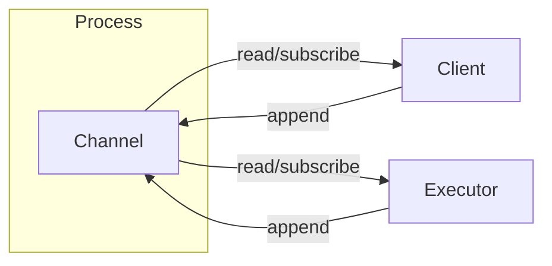
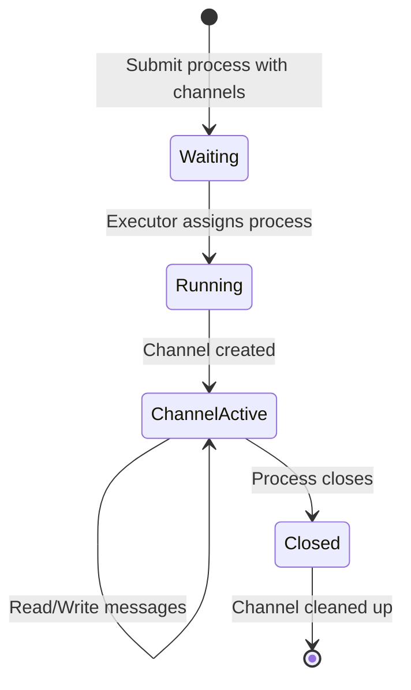
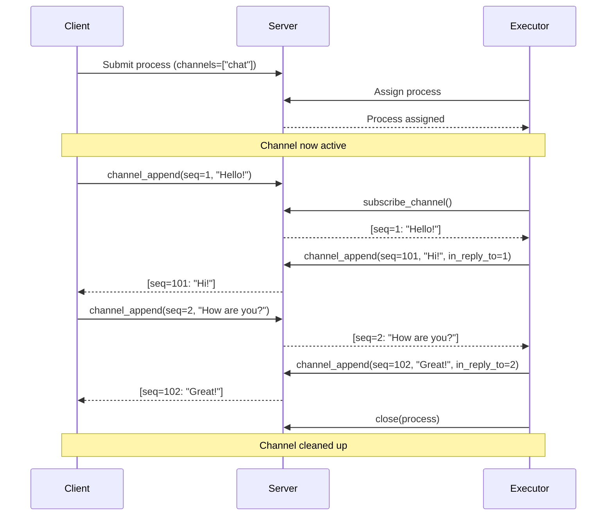
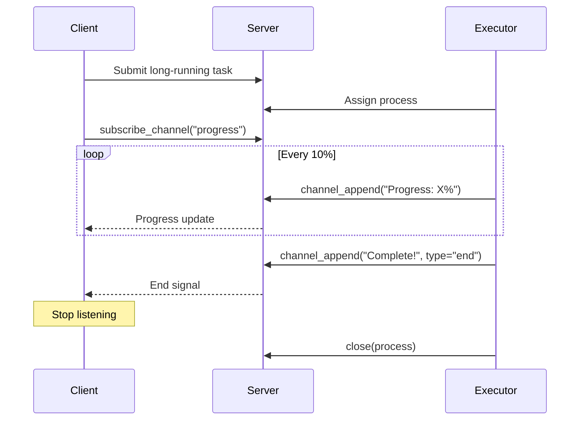

# Channels Tutorial

Channels provide a way for clients and executors to communicate in real-time while a process is running. This enables bidirectional streaming, allowing executors to send progress updates, intermediate results, or implement interactive applications like chat interfaces.

## Overview

A channel is an append-only message log associated with a running process. Both the process submitter (client) and the assigned executor can read and write messages to the channel. Channels are created automatically when a process with channels defined in its function specification is assigned to an executor.



## Channel Lifecycle



## Defining Channels

To use channels, you must define them in the function specification when submitting a process:

```python
from pycolonies import Colonies, func_spec

client = Colonies("localhost", 50080, tls=False)

spec = func_spec(
    "my_function",
    ["arg1", "arg2"],
    "my_colony",
    "my_executor_type",
    maxexectime=60,
    maxwaittime=60
)

# Define one or more channels
spec.channels = ["progress", "chat"]

process = client.submit_func_spec(spec, prvkey)
```

## Appending Messages

Use `channel_append()` to send messages to a channel. Messages have:
- `sequence`: A client-assigned sequence number for ordering
- `payload`: The message content (string or bytes)
- `in_reply_to`: Optional sequence number this message is replying to
- `payload_type`: Optional type marker ("data", "end", "error")

```python
# Append a simple message
client.channel_append(
    process.processid,
    "progress",      # channel name
    1,               # sequence number
    "Processing started...",
    prvkey
)

# Append a reply to sequence 1
client.channel_append(
    process.processid,
    "progress",
    2,
    "Step 1 complete",
    prvkey,
    in_reply_to=1
)

# Signal end of stream
client.channel_append(
    process.processid,
    "progress",
    3,
    "",
    prvkey,
    payload_type="end"
)
```

## Reading Messages

Use `channel_read()` to read messages from a channel:

```python
# Read all messages
entries = client.channel_read(
    process.processid,
    "progress",
    0,    # after_seq: read from beginning
    100,  # limit: max messages to return
    prvkey
)

for entry in entries:
    print(f"Seq {entry['sequence']}: {entry['payload'].decode()}")

# Read only new messages (after sequence 5)
new_entries = client.channel_read(
    process.processid,
    "progress",
    5,    # after_seq
    100,
    prvkey
)
```

Each entry contains:
- `sequence`: The sequence number
- `timestamp`: When the message was appended
- `senderid`: ID of the sender (client or executor)
- `payload`: Message content as bytes
- `type`: Message type ("data", "end", "error")
- `inreplyto`: Sequence number being replied to (if any)

## Real-time Subscription via WebSocket

For real-time streaming, use `subscribe_channel()` which uses WebSocket:

```python
# Blocking subscription that returns all messages
messages = client.subscribe_channel(
    process.processid,
    "progress",
    prvkey,
    after_seq=0,
    timeout=30
)

# Or with a callback for streaming
def on_message(entries):
    for entry in entries:
        print(f"Received: {entry['payload'].decode()}")
    # Return False to stop subscription
    return True

client.subscribe_channel(
    process.processid,
    "progress",
    prvkey,
    timeout=30,
    callback=on_message
)
```

## Complete Example: Chat Between Client and Executor

Here's a complete example showing bidirectional communication:



### Client Code

```python
import threading
import time
from pycolonies import Colonies, func_spec

client = Colonies("localhost", 50080, tls=False)
prvkey = "your_private_key"

# Submit process with chat channel
spec = func_spec("chat_handler", [], "my_colony", "chat_executor",
                 maxexectime=300, maxwaittime=60)
spec.channels = ["chat"]

process = client.submit_func_spec(spec, prvkey)
print(f"Process submitted: {process.processid}")

# Wait for assignment
assigned = client.assign("my_colony", 30, prvkey)
print("Process assigned, starting chat...")

# Listen for responses in background
responses = []
def listen():
    def on_message(entries):
        for e in entries:
            if e['sequence'] >= 100:  # Executor responses have seq >= 100
                print(f"Executor: {e['payload'].decode()}")
                responses.append(e)
        return len(responses) < 5

    client.subscribe_channel(process.processid, "chat", prvkey,
                             timeout=60, callback=on_message)

listener = threading.Thread(target=listen)
listener.start()

# Send messages
time.sleep(0.5)
client.channel_append(process.processid, "chat", 1, "Hello!", prvkey)
time.sleep(1)
client.channel_append(process.processid, "chat", 2, "How are you?", prvkey)
time.sleep(1)
client.channel_append(process.processid, "chat", 3, "Goodbye!", prvkey)

listener.join(timeout=10)
client.close(process.processid, ["Chat completed"], prvkey)
```

### Executor Code

```python
from pycolonies import Colonies

client = Colonies("localhost", 50080, tls=False)
prvkey = "executor_private_key"

# Assign process
process = client.assign("my_colony", 60, prvkey)

if process and "chat" in process.spec.channels:
    print(f"Got chat process: {process.processid}")

    seq = 100  # Use high sequence numbers for responses

    def handle_message(entries):
        nonlocal seq
        for entry in entries:
            if entry['sequence'] < 100:  # Client message
                msg = entry['payload'].decode()
                print(f"Client said: {msg}")

                # Send response
                response = f"You said: {msg}"
                client.channel_append(
                    process.processid, "chat", seq,
                    response, prvkey,
                    in_reply_to=entry['sequence']
                )
                seq += 1
        return True

    # Subscribe and handle messages
    client.subscribe_channel(
        process.processid, "chat", prvkey,
        timeout=120, callback=handle_message
    )

    client.close(process.processid, ["Done"], prvkey)
```

## Streaming Progress Updates

Channels are useful for streaming progress updates from long-running tasks:



### Executor with Progress Updates

```python
def process_large_dataset(client, process, prvkey):
    total_items = 1000
    seq = 1

    for i in range(total_items):
        # Do work...

        # Send progress update every 10%
        if i % 100 == 0:
            progress = (i / total_items) * 100
            client.channel_append(
                process.processid, "progress", seq,
                f"Progress: {progress:.0f}%",
                prvkey
            )
            seq += 1

    # Signal completion
    client.channel_append(
        process.processid, "progress", seq,
        "Complete!",
        prvkey,
        payload_type="end"
    )
```

### Client Monitoring Progress

```python
def on_progress(entries):
    for entry in entries:
        print(entry['payload'].decode())
        if entry.get('type') == 'end':
            return False  # Stop listening
    return True

client.subscribe_channel(
    process.processid, "progress", prvkey,
    timeout=300, callback=on_progress
)
```

## Important Notes

1. **Process must be running**: Channels are only available after a process is assigned (state = RUNNING). The channel is created lazily when first accessed after assignment.

2. **Sequence numbers**: Clients assign their own sequence numbers. Use different ranges for client and executor messages to distinguish them (e.g., client uses 1-99, executor uses 100+).

3. **Message ordering**: Messages are stored in order by (sender_id, sequence). Use `inreplyto` to create explicit request-response correlations.

4. **Channel cleanup**: Channels are automatically cleaned up when a process is closed (SUCCESS or FAILED state).

5. **Authorization**: Only the process submitter and the assigned executor can read/write to a process's channels.

## Running the Tests

To run the channel tests:

```bash
export COLONIES_SERVER_HOST=localhost
export COLONIES_SERVER_PORT=50080
export COLONIES_TLS=false
export COLONIES_COLONY_NAME=test
export COLONIES_PRVKEY=your_executor_private_key
export COLONIES_SERVER_PRVKEY=your_server_private_key

python3 test/channel_test.py
```
