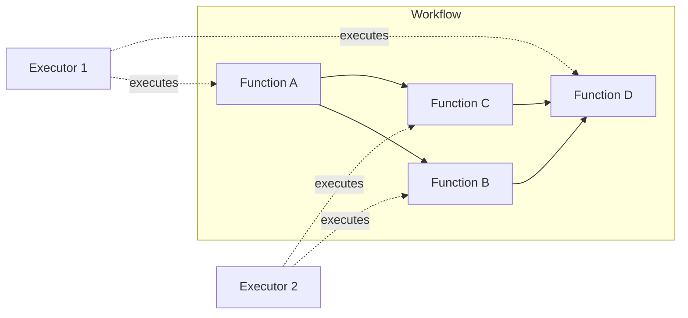
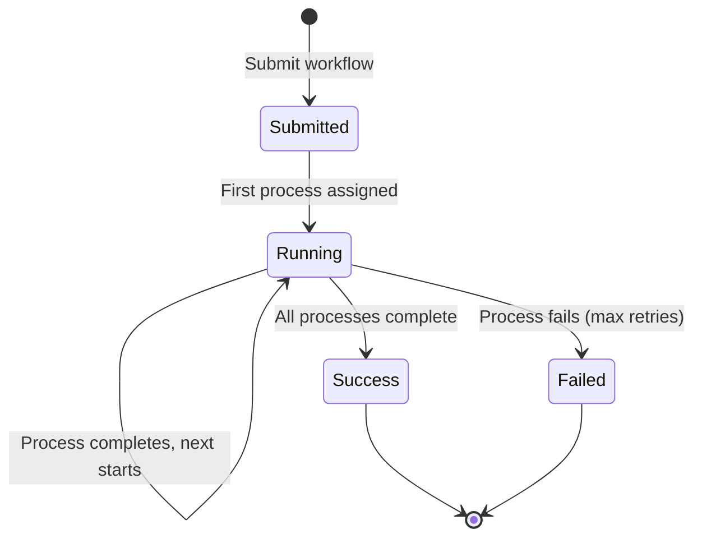
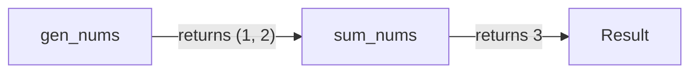
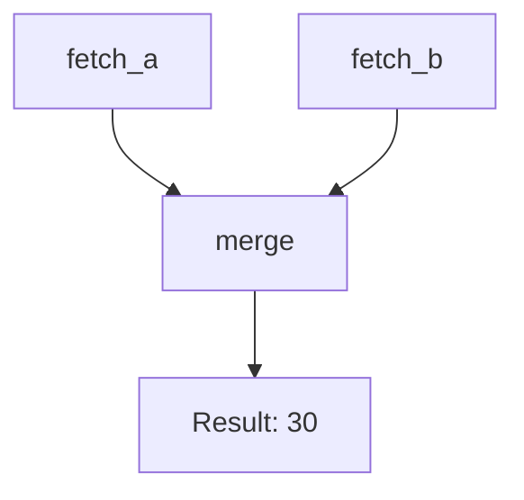
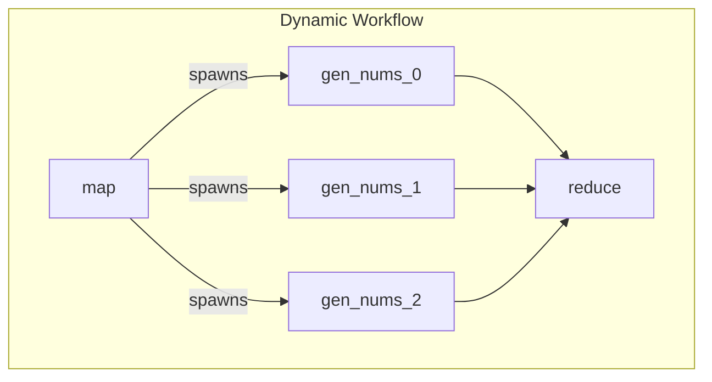
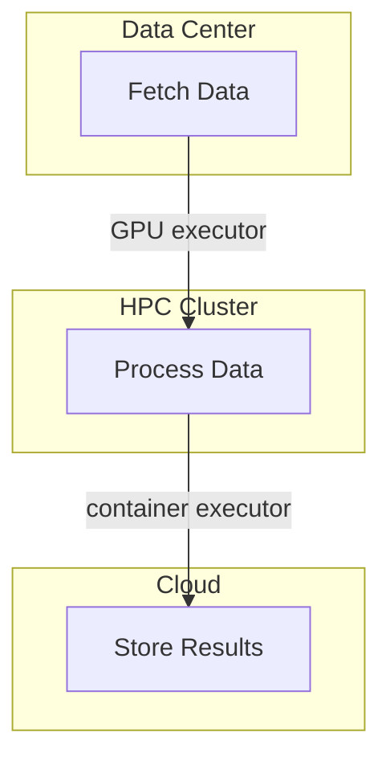
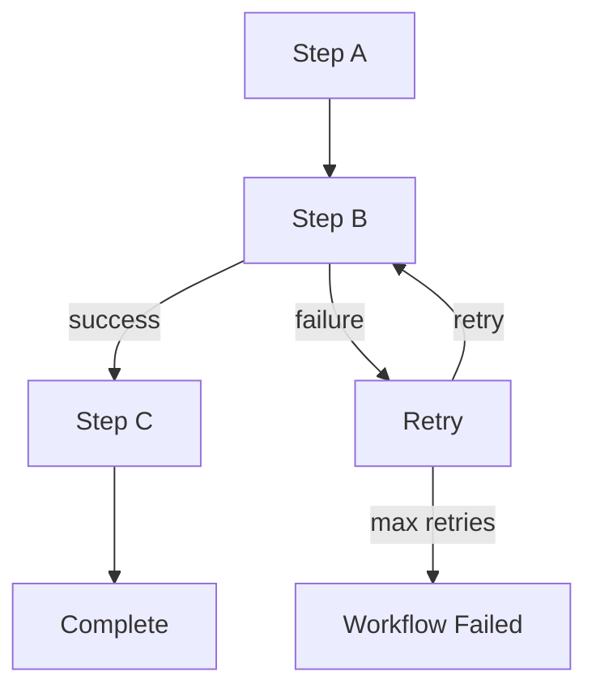

# Workflows Tutorial

Workflows allow you to create computational DAGs (Directed Acyclic Graphs) where multiple functions execute in a defined order with data passing between them. This enables building complex processing pipelines that span multiple executors across different platforms.

## Overview

A workflow consists of multiple function specifications with dependencies between them. The Colonies server manages execution order and data flow automatically.



## Workflow Lifecycle



## Basic Workflow Example

Create a simple two-step workflow where `gen_nums()` produces data and `sum_nums()` consumes it:

```python
from pycolonies import Colonies, func_spec, Workflow

client = Colonies("localhost", 50080, tls=False)
prvkey = "your_private_key"
colony_name = "test"

# Define functions
def gen_nums(ctx={}):
    return 1, 2

def sum_nums(n1, n2, ctx={}):
    return n1 + n2

# Create workflow
wf = Workflow(colonyname=colony_name)

# First function - generates data
f1 = func_spec(
    func=gen_nums,
    args=[],
    colonyname=colony_name,
    executortype="python-executor",
    maxexectime=100,
    maxwaittime=100
)
wf.functionspecs.append(f1)

# Second function - depends on first
f2 = func_spec(
    func=sum_nums,
    args=[],
    colonyname=colony_name,
    executortype="python-executor",
    maxexectime=100,
    maxwaittime=100
)
f2.conditions.dependencies.append("gen_nums")
wf.functionspecs.append(f2)

# Submit workflow
processgraph = client.submit_workflow(wf, prvkey)
print(f"Workflow submitted: {processgraph.processgraphid}")
```



## Workflow with Multiple Dependencies

Create more complex workflows with multiple parallel paths:

```python
def fetch_a(ctx={}):
    return {"source": "A", "value": 10}

def fetch_b(ctx={}):
    return {"source": "B", "value": 20}

def merge(a, b, ctx={}):
    return a["value"] + b["value"]

wf = Workflow(colonyname=colony_name)

# Two parallel fetchers
f_a = func_spec(func=fetch_a, args=[], colonyname=colony_name,
                executortype="python-executor", maxexectime=60, maxwaittime=60)
wf.functionspecs.append(f_a)

f_b = func_spec(func=fetch_b, args=[], colonyname=colony_name,
                executortype="python-executor", maxexectime=60, maxwaittime=60)
wf.functionspecs.append(f_b)

# Merge depends on both fetchers
f_merge = func_spec(func=merge, args=[], colonyname=colony_name,
                    executortype="python-executor", maxexectime=60, maxwaittime=60)
f_merge.conditions.dependencies.append("fetch_a")
f_merge.conditions.dependencies.append("fetch_b")
wf.functionspecs.append(f_merge)

processgraph = client.submit_workflow(wf, prvkey)
```



## Dynamic Workflows (MapReduce Pattern)

Workflows can be modified during execution. A function can add new child processes dynamically, enabling patterns like MapReduce.



### Map Function

The map function dynamically adds child processes:

```python
def map(ctx={}):
    code = '''def gen_nums(ctx={}):
    return 1, 2'''

    processgraphid = ctx["process"].processgraphid
    map_processid = ctx["process"].processid
    executor_prvkey = ctx["executor_prvkey"]

    # Get the processgraph
    processgraph = colonies.get_processgraph(processgraphid, executor_prvkey)

    # Find the reduce process
    reduce_process = colonies.find_process("reduce", processgraph.processids, executor_prvkey)
    reduce_processid = reduce_process.processid

    # Add child processes dynamically
    insert = True
    for i in range(5):
        f = func_spec(
            func="gen_nums",
            args=[],
            colonyname=ctx["colonyname"],
            executortype="python-executor",
            maxexectime=100,
            maxwaittime=100,
            code=code
        )
        colonies.add_child(
            processgraphid,
            map_processid,
            reduce_processid,
            f,
            f"gen_nums_{i}",
            insert,
            executor_prvkey
        )
        insert = False
```

### Reduce Function

The reduce function aggregates results from all gen_nums calls:

```python
def reduce(*nums, ctx={}):
    total = 0
    for n in nums:
        total += n
    return total
```

### Submitting the MapReduce Workflow

```python
wf = Workflow(colonyname=colony_name)

# Map function
f_map = func_spec(
    func=map,
    args=[],
    colonyname=colony_name,
    executortype="python-executor",
    maxexectime=100,
    maxwaittime=100
)
wf.functionspecs.append(f_map)

# Reduce function - depends on map
f_reduce = func_spec(
    func=reduce,
    args=[],
    colonyname=colony_name,
    executortype="python-executor",
    maxexectime=100,
    maxwaittime=100
)
f_reduce.conditions.dependencies.append("map")
wf.functionspecs.append(f_reduce)

processgraph = client.submit_workflow(wf, prvkey)
# Result: (1+2) * 5 = 15
```

## Monitoring Workflows

### Using CLI

```console
$ colonies workflow ps

╭──────────────────────────────────────────────────────────────────┬─────────────────────┬───────────╮
│ PROCESSGRAPH ID                                                  │ SUBMISSION TIME     │ INITIATOR │
├──────────────────────────────────────────────────────────────────┼─────────────────────┼───────────┤
│ a1b2c3d4e5f6...                                                  │ 2024-01-15 10:30:00 │ myuser    │
╰──────────────────────────────────────────────────────────────────┴─────────────────────┴───────────╯
```

```console
$ colonies workflow get --processgraphid <id>
```

### Using Python

```python
# Get workflow status
processgraph = client.get_processgraph(processgraphid, prvkey)

print(f"State: {processgraph.state}")
print(f"Processes: {len(processgraph.processids)}")

# Get individual process details
for pid in processgraph.processids:
    process = client.get_process(pid, prvkey)
    print(f"  {process.spec.funcname}: {process.state}")
```

## Cross-Platform Workflows

Workflows can span multiple executor types and platforms:



```python
wf = Workflow(colonyname=colony_name)

# Fetch from data source (container executor)
f1 = func_spec(func="fetch", args=["dataset"],
               colonyname=colony_name,
               executortype="container-executor",
               maxexectime=300, maxwaittime=60)
wf.functionspecs.append(f1)

# Process on HPC (hpc executor)
f2 = func_spec(func="process", args=[],
               colonyname=colony_name,
               executortype="hpc-executor",
               maxexectime=3600, maxwaittime=300)
f2.conditions.dependencies.append("fetch")
wf.functionspecs.append(f2)

# Store results (cloud executor)
f3 = func_spec(func="store", args=[],
               colonyname=colony_name,
               executortype="cloud-executor",
               maxexectime=120, maxwaittime=60)
f3.conditions.dependencies.append("process")
wf.functionspecs.append(f3)

processgraph = client.submit_workflow(wf, prvkey)
```

## Error Handling

Workflows handle failures gracefully:



- **maxretries**: Number of times a failed process is retried
- **maxexectime**: Maximum execution time before process is released
- **maxwaittime**: Maximum time to wait for executor assignment

```python
f = func_spec(
    func=my_function,
    args=[],
    colonyname=colony_name,
    executortype="python-executor",
    maxexectime=300,   # 5 minutes max execution
    maxwaittime=60,    # 1 minute to find executor
    maxretries=3       # Retry up to 3 times on failure
)
```

## Best Practices

1. **Name functions descriptively**: Function names become process identifiers in the workflow graph.

2. **Set appropriate timeouts**: Use `maxexectime` and `maxwaittime` based on expected execution times.

3. **Use retries for transient failures**: Set `maxretries` for operations that may fail temporarily.

4. **Keep functions focused**: Each function should do one thing well.

5. **Pass data through return values**: The output of a parent process becomes input to dependent processes.

## CLI Reference

```console
# List running workflows
colonies workflow ps

# List waiting workflows
colonies workflow psw

# List successful workflows
colonies workflow pss

# List failed workflows
colonies workflow psf

# Get workflow details
colonies workflow get --processgraphid <id>

# Remove a workflow
colonies workflow remove --processgraphid <id>

# Remove all workflows
colonies workflow removeall
```

## Running the Examples

```bash
# Terminal 1: Start the Python executor
python3 examples/python_executor.py

# Terminal 2: Submit a workflow
python3 examples/workflow_example.py
```
